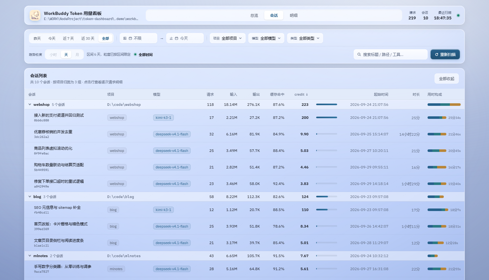
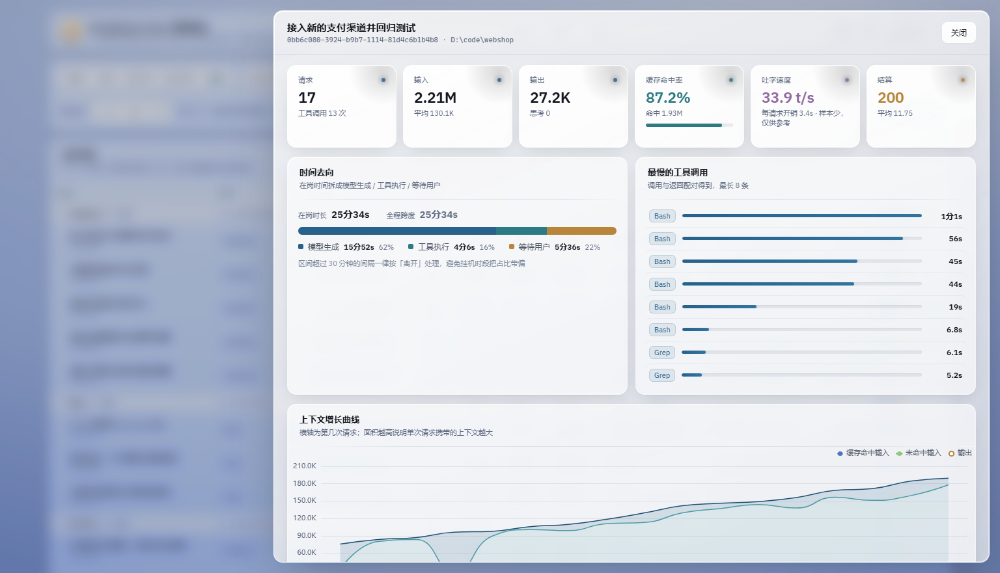
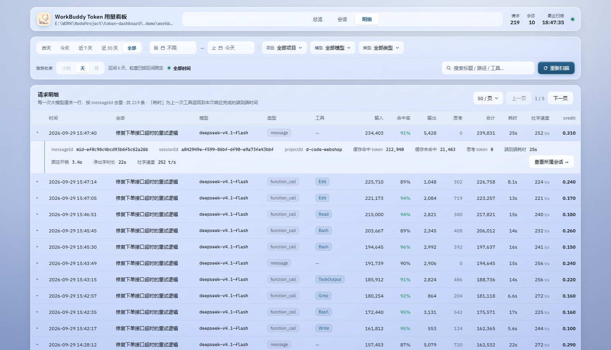
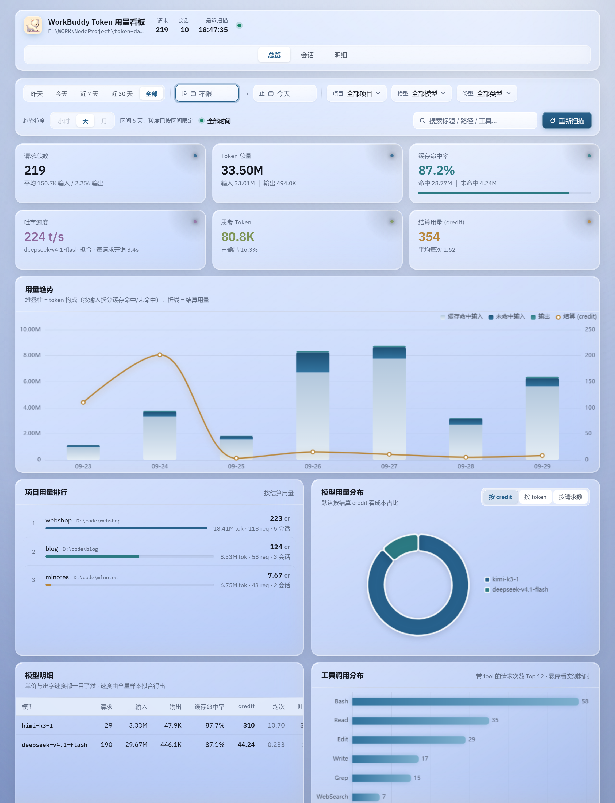

<div align="center">


# WorkBuddy Token 用量看板

**解析 WorkBuddy 本地会话日志，把 token 消耗、缓存命中、credit 结算与响应速度还原成一张看得懂的看板**

[](https://nodejs.org)
[](LICENSE)
[](server)
[](web)


</div>

---

WorkBuddy 本身不提供任何 token 用量视图。这个项目直接读取它在本地落盘的会话 JSONL
（`~/.workbuddy/projects/**/*.jsonl`），起一个**零三方依赖**的解析服务和一个 Vue 3 看板，
回答四个平时根本没法回答的问题：

- **钱花在哪了** —— credit 按项目 / 模型 / 会话 / 工具摊开，贵的那几个一目了然
- **缓存命中率什么时候掉的** —— 趋势图按「命中输入 / 未命中输入 / 输出」堆叠，
  费用上涨究竟是量涨了还是命中率掉了，一眼分清
- **模型到底快不快** —— 本地**没有任何耗时字段**，吐字速度和每请求固定开销是从
  事件时间线里推出来的（见[耗时是怎么算出来的](#耗时是怎么算出来的)）
- **时间花在哪了** —— 模型生成 / 工具执行 / 等待用户 / 离开电脑，四段互不重叠

技术栈：**Node.js（服务端仅用 `node:` 内置模块）+ Vue 3 + Vite + ECharts**。

> 下文截图与数字均来自 `npm run demo` 生成的合成数据（3 个虚构项目、2 个模型），
> 不含任何真实使用记录。时间线按真实规律构造，所以耗时推导与速度拟合在演示数据上同样成立。

## 看板长什么样

**总览下部：时间去向 + 最慢的工具调用。** 全程 19 小时 6 分里 84% 处于离开状态，
画进去会把另外三段压成细线，所以条只画在岗的 2 小时 59 分
（模型 39% / 工具 31% / 等待 30%），离开时长单独用一行文字交代。
右边是按 `callId` 配对算出的工具实测耗时——不需要任何推算假设，点一行直接跳会话。


**会话列表：按项目分组，成本结构直接摊开。** 演示数据里 `kimi-k3-1` 用 29 次请求
花掉 310 credit（占 88%），`deepseek-v4.1-flash` 用 190 次才 44 credit——
**13% 的请求花掉 88% 的钱**。加上速度维度结论更完整：贵之外，出字还慢 7 倍
（33.9 t/s vs 244 t/s）。每行右侧的「用时构成」微缩条与总览配色一致。



**会话详情抽屉：** 时间去向、最慢工具、上下文增长曲线、逐次请求明细（含耗时与瞬时速度），
用来定位「上下文膨胀」「低命中率的长尾请求」和「卡在哪条命令上」。



**请求明细：按 `messageId` 去重，展开可见耗时推导全过程**——
端到端耗时 25s → 每请求固定开销 3.4s → 净出字时长 22s → 瞬时速度 252 t/s。
任何一段算不出来都显示 `—`，而不是编一个数。



**原生控件全部替换为自绘**：`<select>` 的展开列表和 `<input type="date">` 的日历面板
浏览器不开放样式，所以用 `AppSelect` / `AppDatePicker` 重写（`Teleport` 到 body、
支持键盘操作、空间不足自动上翻）。筛选生效后 KPI 与全部图表联动。


**窄屏适配**：1420px 以下 KPI 变 3 列 × 2 排，卡片恒等高（进度条槽位恒占位，
不靠 padding 硬凑）。



## 快速开始

环境要求：**Node.js ≥ 20**。无需数据库，无需任何三方服务。

### 没装 WorkBuddy？先看演示

```bash
npm install
npm run build
npm run demo        # 生成合成数据并启动 → http://localhost:5178
```

`npm run demo` 会在 `.demo/` 下生成一份合成会话 JSONL 并以其为数据源启动服务，
方便体验与截图；真实数据源不变，两条命令互不影响。

### 用真实数据

装了 WorkBuddy 的话，数据已经在本地了，直接：

```bash
npm install
npm run dev         # 前后端一起起：看板 :5177 / 接口 :5178
```

数据目录默认取 `~/.workbuddy`，可用环境变量覆盖：

```bash
WORKBUDDY_HOME=D:/other/.workbuddy npm run dev:server
```

生产模式（单端口，服务端顺带托管打包产物）：

```bash
npm run build
npm start           # http://localhost:5178
```

### Windows 提示

npm 在 workspace 下可能漏装平台专用的可选依赖，若启动报
`Cannot find module @rollup/rollup-win32-x64-msvc` 或 `@esbuild/win32-x64`：

```bash
npm i -D @rollup/rollup-win32-x64-msvc @esbuild/win32-x64
```

这两个包已在 devDependencies 里，全新安装不会再遇到；换到 macOS / Linux 时删掉重新
`npm install` 即可。另外，npm workspaces 的软链记录的是绝对路径，**移动项目目录后**
需要重跑一次 `npm install`（报 `Cannot find module 'token-dashboard-server'` 就是这个原因）。

## 数据从哪来

WorkBuddy 把每个工作区的会话记录写成追加式 JSONL：

```
~/.workbuddy/projects/<项目目录名>/<sessionId>.jsonl
```

- `<项目目录名>` 是 cwd 的编码形式（如 `d-CODE-MyApp` 对应 `D:\code\MyApp`），
  目录名只是兜底，每行里的 `cwd` 字段才是真值
- 追加写：文件只会变长，不会原地改写——这决定了可以增量解析

每一行是一个 JSON 对象，`type` 取值：

| type | 含义 |
|---|---|
| `session-meta` | 会话元信息 |
| `ai-title` | AI 生成的会话标题（看板里的会话名） |
| `message` | 用户/助手消息，**可能带用量** |
| `reasoning` | 思考过程 |
| `function_call` | 工具调用，**大部分用量在这里** |
| `function_call_result` | 工具返回 |
| `file-history-snapshot` | 文件快照 |

token 用量只挂在有真实请求的行上，位置是 `providerData.rawUsage`：

```jsonc
{
  "type": "function_call",
  "timestamp": 1790000000000,
  "sessionId": "3f9c2a1e-47b8-4d0f-9a51-c2e8d6b03a77",
  "cwd": "D:\\code\\webshop",
  "name": "Bash",
  "providerData": {
    "messageId": "01a9d3f2c8e41b675a209d1c3e8b7f11",   // 唯一键
    "traceId": "a71f3c02b5d94e8a",                     // 一轮对话，含多次请求
    "model": "deepseek-v4.1-flash",
    "rawUsage": {
      "prompt_tokens": 36945,               // 本次请求的输入
      "completion_tokens": 30382,           // 本次请求的输出（含思考）
      "total_tokens": 67327,
      "prompt_cache_hit_tokens": 8832,      // 命中提示缓存的输入
      "prompt_cache_miss_tokens": 28113,    // 未命中的输入（按全价计）
      "completion_thinking_tokens": 23690,  // 思考 token
      "credit": 2.14                        // 平台算好的结算单位 = 真实成本
    }
  }
}
```

## 三个必须踩准的口径

**1. 计数单位是 `messageId`，不是行数，也不是 `traceId`。**
`messageId` 全局唯一，标识一次 API 请求；`traceId` 标识一轮用户对话，
里面包含「思考 → 调工具 → 拿结果 → 再思考」的多次请求，会重复 1~58 次。
按 `traceId` 计数会把用量少算几倍，看板统一以 `messageId` 去重。

**2. `rawUsage` 是单次请求的增量，不是累计值。**
相邻两次请求的 `prompt_tokens` 从 36945 涨到 67363，是上下文随对话增长，
不是"累计到 67363"，求和时直接相加即可。

**3. `credit` 就是成本，不需要自己维护价格表。**
credit 和 token 数不成正比——一个真实例子：`kimi-k3-1` 6 次请求结算 107.2 credit，
`deepseek-v4.1-flash` 404 次才 59.4，**6 次花掉的钱是 404 次的 1.8 倍**。
自建价格表很难算准这种差异，直接用平台算好的 `credit` 反而最准。

## 耗时是怎么算出来的

本地 JSONL **没有任何耗时字段**（把 13 个会话、4445 行、1162 条带用量的记录
全字段枚举验证过）。但时间可以从事件时间线上推出来，只需要三个事实：

1. 一次请求 = 一个 `providerData.messageId`，且恰好只有一行带 `rawUsage`——
   这一行的 `timestamp` 就是该次请求的**完成时刻**。
2. 请求的起点 ≈ 上一个**边界事件**（用户消息 / 上一条工具返回）的 `timestamp`，
   两者相减 = 端到端耗时。
3. 工具耗时可以直接配对：`function_call.callId` ↔ `function_call_result.callId`，
   实测几乎 100% 配得上（配不上的只有被中断的会话）。这是耗时维度里最硬的部分。

`reasoning` / `file-history-snapshot` 这类行的时间戳和请求完成点相差不到 20 毫秒，
留在时间线上只会把 127 秒的生成时间错记到某个碎行头上，所以直接丢弃。

**直接相除是错的。** `输出 token ÷ 耗时` 会严重低估短请求，实测按输出量分桶：

| 输出 token | 平均耗时 | 相除得到的"速度" |
|---|---|---|
| 0 – 200 | 3.97s | 29 t/s |
| 1 000 – 5 000 | 10.9s | 178 t/s |
| 5 000 – 20 000 | 33.0s | 226 t/s |
| 20 000+ | 128s | 239 t/s |

真相是 `耗时 ≈ 每请求固定开销 + 输出 ÷ 吐字速度`，所以用**最小二乘拟合**：
斜率倒数就是吐字速度，截距就是固定开销。真实数据实测
`deepseek-v4.1-flash`：斜率 → 250 t/s，截距 → 3.41s，R² = 0.96（n = 1154）。
每条请求的**净出字时长 = 耗时 − 该模型固定开销**，短请求也能得到量级正确的瞬时速度。

两个口径必须分开说，混着展示会让人以为数字前后矛盾：

| 口径 | 定义 | 用在哪 |
|---|---|---|
| 拟合吐字速度 | 全量样本拟合斜率，按输出量加权 | 看板主指标、模型明细 |
| 实测平均速度 | Σ输出 ÷ Σ净时长，**系统性偏低**（含调度空转） | 只作对照 |

已知限制：净出字时长里仍含 prefill（处理输入）的时间，未命中缓存输入很大的请求
单条读数会被拉低；这一项主要落在截距里，不影响模型级斜率。想彻底分离需要把
prefill 一起建模，但缓存命中/未命中两个字段高度共线，直接多元回归不收敛，留作后续。

**时间去向**把在岗时长拆成模型生成 / 工具执行 / 等待用户，阶段划分互不重叠：
并行工具调用先来 `fc#1`、`fc#2` 再来 `fcr#1`、`fcr#2`，逐段累加正好等于
`fcr#2 − fc#1`，不会因为工具并行而重复计时。相邻事件间隔超过 30 分钟视为
「离开电脑」，不计入任何阶段、单独交代——否则一次午休就能把其余三段压成细线。

## 架构

```
浏览器 (Vue3 + ECharts, :5177)
    │  /api/*  （Vite dev proxy）
    ▼
解析服务 (Node http, :5178)
    ├── scanner.js   发现 projects/**/*.jsonl，增量续读（记录 + 时间线事件）
    ├── parser.js    行 → 规范化用量记录 / 时间线事件
    ├── timing.js    耗时推导：请求耗时、工具配对、阶段分解、速度拟合
    ├── store.js     内存存储 + 过滤/分组/分桶聚合
    └── index.js     REST API + 每 15s 自动重扫
```

解析服务**只用 `node:` 内置模块**，没有 express、没有 sqlite，`npm start` 即跑。

**增量策略**：JSONL 是追加写的，按文件维护 `{ size, offset, mtimeMs }`——
没变直接跳过；变大就从 `offset` 读尾巴、只解析新增行；变小判定被重写、整体重解析；
且只处理到最后一个 `\n`，避免把正在写的半行解析掉。

**时间线事件也必须增量累积**：耗时的差值跨解析块——工具跑了几分钟，中间文件可能
被追加过好几轮，某次请求的起点就落在上一次读进来的那段里。所以解析块除了吐记录，
还要吐一份有序事件流（用户消息 / 带用量的请求 / 工具返回，其余行直接丢弃），
攒齐之后才做配对；配对逻辑放在单行解析里的话，每条请求的起点都会丢。

## API

统一支持 `from` `to` `projectId` `model` `kind` `keyword` `granularity`（`hour|day|month`），
所有视图口径一致：

| 端点 | 用途 |
|---|---|
| `GET /api/meta` | 数据源路径、可用筛选值、记录数、模型速度画像 |
| `GET /api/overview` | KPI + 趋势 + 按模型/项目/工具分布 + 时间去向 + 工具耗时排行 |
| `GET /api/sessions` | 会话级聚合（AI 标题、缓存命中率、时长、时间去向） |
| `GET /api/session?sessionId=` | 单会话逐次请求（耗时 / 净出字时长 / 瞬时速度）+ 上下文增长曲线 |
| `GET /api/requests` | 请求明细，分页 |
| `POST /api/refresh` | 立即重扫 |

速度相关字段别搞混：`summary.measuredSpeed` 是实测口径（偏低）；
`overview.speed.tps` 是拟合口径，界面上那个主指标；`step.tps` 是单条请求的
瞬时速度，噪声大，净出字时长不足时给 `null`。

## 测试

```bash
npm test               # 单测：分次追加 == 全量解析；耗时推导、速度拟合的正反用例
npm run test:reconcile # 独立全量解析 vs 看板 API 对账（需服务在跑）
npm run test:e2e       # 真实浏览器渲染 + 71 项交互断言（需先 build）
```

`test:reconcile` 的第二段会**独立重写一遍耗时算法**（刻意不 import `src/timing.js`，
否则等于拿同一份代码验自己），只挑最近没被写过的静态会话，逐项比对工具耗时合计、
每次请求耗时、阶段时长与全程跨度——正在写入的会话不参与比对，那是时序问题不是算错。

`test:e2e` 用 CDP 驱动无头浏览器真实渲染：逐个切 tab、开抽屉、展开明细与自绘控件、
断言页面已无原生 `select` / date 输入、控制台无 error / warning，并断言
「时间去向三段堆叠条宽度之和 = 100%」（算漏一段只会表现为条变短，肉眼很难发现），
最后把视口压到 1150px 断点，验证只在窄屏暴露的 KPI 等高问题。
**这一步很必要**——ECharts 容器挂在 `v-else-if` 分支里、`v-show` 对多根组件不生效、
断言表达式写错"假通过"，构建阶段全都不报错，只有真实渲染才暴露。

## 目录结构

```
server/                     零三方依赖的解析服务
  src/config.js             定位 ~/.workbuddy，解析项目目录名
  src/parser.js             行 → 规范化用量记录 + 时间线事件
  src/scanner.js            发现 JSONL + 增量续读（记录与事件都增量累积）
  src/timing.js             耗时推导：请求耗时 / 工具配对 / 阶段分解 / 速度拟合
  src/store.js              内存存储 + 过滤/分组/分桶聚合
  src/index.js              REST API + 静态托管 + 15s 自动重扫
  test/incremental.test.js  增量解析单测 + 耗时推导单测
  test/reconcile.js         与独立全量解析对账（含耗时维度的独立复算）
web/                        Vue3 + Vite + ECharts
  src/style.css             液态玻璃设计系统
  src/composables/          useChart（按需引入 + 懒初始化）、usePopup（弹层定位）
  src/components/ui/        AppSelect、AppDatePicker（自绘控件）
  src/components/           PhaseBar / PhaseMiniBar（时间去向条）、SessionDrawer
  src/views/                Overview / Sessions / Requests
scripts/demo.js             生成合成演示数据并启动（npm run demo）
tools/e2e-verify.js         真实浏览器端到端验证（71 项断言）
tools/screenshots.js        重新生成 README 截图（基于演示数据）
scripts/dev.js              一条命令同时起前后端
```

## 路线图

- **成本告警**：定时扫描，超过日/周 credit 阈值时通知；速度退化纳入同一套告警
- **落库**：把 `store.js` 的 upsert 换成 SQLite，支持跨月留存与复杂查询
- **提示词优化建议**：结合 `function_call_result` 的体积，找出「回灌给模型的工具输出过大」的调用
- **对比视图**：按模型横向对比「同样任务谁更省、谁更快」
- **把 prefill 一起建模**：加输入项会更准，但缓存字段高度共线，需要先中心化或改岭回归
- **首字延迟（TTFT）**：目前拿不到，需要平台侧埋点
- **深色模式**：玻璃设计 token 已集中在 `:root`，加一套深色变量即可切换

## 贡献

Issue / PR 都欢迎。提交前请跑一遍 `npm test` 与 `npm run test:e2e`。

## License

[MIT](LICENSE)
